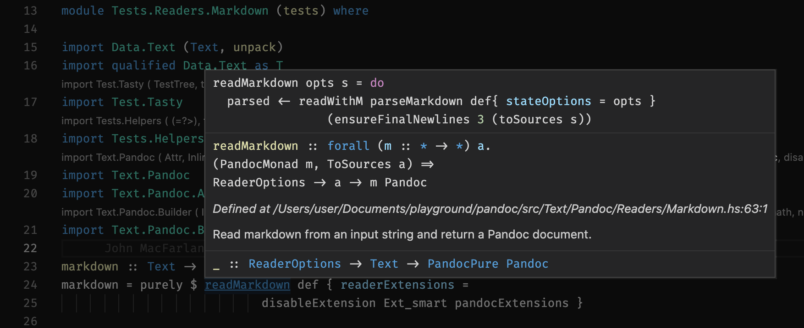

It has been some time since I last studied Haskell. 
When I look at Monad again, it feels more comfortable about it, and the way to use it to write code.
So I've decided to have a look at the most popular Haskell software - Pandoc, to see how Haskell is used 
to structure a large and mature programme.

However it took more than I expected to view the source code plus Haskell plugin for type hinting on VS code.

## Getting started

First step, clone the repository.

```bash
git clone https://github.com/jgm/pandoc.git

cd pandoc
```

Then, open it with VS code.

```bash
code .
```

The [VS code plugin Haskell](https://marketplace.visualstudio.com/items?itemName=haskell.haskell) should be the most convenient and popular one for type check and type hinting as of now.
I remember the last time it required you to install Haskell Language Server manually.

That's it! ...right? No.

## First error message

An error message popped up on VS code.

> Project requires Cabal but it isn't installed

Frankly, I've never used `cabal` to build and package Haskell project. I picked `stack`. 
Apparently I have to learn both eventually, despite the suggestion of "just pick one (stack) and stick to it".

So I followed the instruction of the error message, and use `ghcup` to install `ghc` and `cabal` on [https://www.haskell.org/ghcup/](https://www.haskell.org/ghcup/).

## The same error message

The error message persisted. What..?

After some frustration and some google searches, I found [this github issue comment](https://github.com/haskell/haskell-language-server/issues/236#issuecomment-877706828) that **somehow** resolved the issue, by opening VS code with additional flag `--force-user-env`!

## ghc version not supported

After restarting vs code with the additional flag, the error was gone, but another one popped up:

> haskell-language-server 1.3.0 for GHC 8.10.7 is not available on Darwin. See the list of supported versions here

I happened to pick a ghc version that is not supported by haskell language server. Okay, let's install another one.
I checked the supported ghc versions on [https://github.com/haskell/vscode-haskell#supported-ghc-versions](https://github.com/haskell/vscode-haskell#supported-ghc-versions), and check the ghc version I's using with command `ghcup tui`. Right, I's using `8.10.7`.

At the time, the support for version `9.0.1` was limited. Alright, let's downgrade it to `8.10.5` with the `ghcup` tool.

## Stuck in the build process

Error messages are all gone now! All I need to do is to wait a hackable long time for the haskell plugin to initialize. 
It needs to build the project. At some point, my macbook's fan stopped spinning, however the building process was still in progress.

I checked the vs code output of the haskell plugin. Turned out the build process hanged at the "building the network package".

Luckily, I found the solution on [this github issue](https://github.com/haskell/cabal/issues/6845#issuecomment-873501610) again.
All I need do was to change to **another ghc version**. Let's downgrade again to `8.10.4`.

The build process went thorough the network package!

## final step: wait

Wait for the build process to finish. Then, voila! Isn't is easy?
