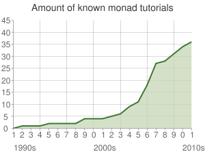

As a developer using primarily JavaScript for years, my first attempt to learn Haskell was to skip reading bunch of documentation and just get started with intuition. The attempt failed miserabily.

## Setup

First, you need `ghc` at least to compile Haskell code. How would you install that? The Haskell official website provided me the **non-optimal** way to manage the `ghc` installation, which was to install a specific `ghc` version into the system. It was not optimal because you can indeed use `stack` to bootstrap your project, and manage the `ghc` version for you.

However, it's better now that a more comprehensive tool `GHCup` [is available on the officla Haskell website](https://www.haskell.org/downloads/#linux-mac-freebsd). But `stack` is also suggested as the alternative. So, which one should a newcomer pick...?

## Building tool

`cabal` and `stack` are two major Haskell build tools. And it's not like `npm` vs `yarn` at all.

`stack` uses `cabal` under the hood. The main goal of `stack` is to solve the problem of dependency hell when building with `cabal`.
By default, `stack` uses packages from a curated set of versions of libraries from stackage. If the libraries are included in the stackage package set, they're going to fit together and compile.

Besides, `stack` has [better UX than cabal](https://stackoverflow.com/questions/30913145/what-is-the-difference-between-cabal-and-stack).
It's the recommended tool for starters.

### `stack install` !== `yarn install`

`stack install` command installs the **binary of the software into your system, not adding a dependency to your project**.
You have to add the dependency in config file manually which feels primitive.

## Compilation

It took waaaaay longer to add a new dependency and build the project. Whenever you add a new dependency, you have to compile it. For example, the most popular Haskell project on github Pandoc, [took around 17 mins to build the macOS artifact](https://github.com/jgm/pandoc/runs/3531295377?check_suite_focus=true). I can finally feel this xkcd now.


## Ecosystem and community

The Haskell community is much smaller than that of Javascript. Here is the difference in popularity from the [2021 Developer Survey by Stack Overflow](https://insights.stackoverflow.com/survey/2021#programming-scripting-and-markup-languages)


### The library of choice...?

There are powerful and mature libraries like [aeson](https://hackage.haskell.org/package/aeson), [mtl](https://hackage.haskell.org/package/mtl), [optparse-applicative](https://hackage.haskell.org/package/optparse-applicative). But there are even more unmaintained, outdated or non-versatile libraries. Sometimes you could get frustrated in this process of finding the right library, which could turn out that the library doesn't exist yet.

What's more, occasionally there can be multiple similar libraries, that you have no idea which one is the better choice. The only way is to try them all out.

### Learn by code example VS type puzzle

JS libraries have A LOT more code examples for varies use cases, either from library's documentation or tutorials and blog posts on the web. In the world of Haskell, except for popular libraries, what you got are mostly type signatures of functions. In many cases, you may not find the code solution on the web. Your objective is to solve the type puzzle, to get the desired transformation. [Hoggle](https://hoogle.haskell.org) will be your best friend for searching functions with specific type signature!

For example, if you are looking for a function which takes a `Text` and return a `String`, [by searching the function signature](https://hoogle.haskell.org/?hoogle=Text+-%3E+String&scope=set%3Astackage) `Text -> String`, you get `unpack` from library `Text` as the first search result.


## Development

### Module import syntax

A package and a module are different. A package is a collection of modules. When you need a library (package), you add the package as project dependency. Then, in source code, you import the modules provided by the library. However the name of modules and the package can be totally unrelated.

```hs
-- from package `containers`
import Data.List

-- from package `optparse-applicative`
import Options.Applicative
```

So, if you're not a seasoned Haskeller, when you read the source code of other Haskell projects, you could have no idea where the module come from, without the help of hoogle and type hinting by haskell lanaguage server.

### Language extensions as feature flags

Though `ghc` enhences with [newer versions](https://github.com/ghc/ghc/blob/master/libraries/base/changelog.md), many language features are not toggled on unless explicitly enabled. They are called "[language extensions](https://wiki.haskell.org/Language_extensions)".
Language extensions can be enabled via command line flags, annotation on top of source code (shown below), or [config file](https://github.com/chauchakching/just-json-server/blob/d870430eaab5820c028defc873c96f0e0835eada/package.yaml#L38). I recommend enabling the language extensions through config file once and for all.

```hs
{-# LANGUAGE OverloadedStrings #-}
{-# LANGUAGE DeriveGeneric #-}

import qualified Data.Text as T
import Options.Applicative
```

#### Can I have all of them?

One might think: why not simply enable them all? In fact **some language extensions don't get along with others** for certain combination of library dependencies!

Some of the language extensions like `OverloadedStrings` are often used, while some of them like `MultiWayIf` have minor usage, and some of them like `OverlappingInstances` must be used with caution and could be considered bad. 

Take a look at [an opinionated guide to haskell](https://lexi-lambda.github.io/blog/2018/02/10/an-opinionated-guide-to-haskell-in-2018/) for reference of a list of suggested language extensions.

#### But why language extensions?

Haskell has been a very academic-facing and advanced functional programming language for years. Language extensions allows researchers to play with Haskell with great flexibility in a per-project basis. This way, Haskell fulfills the usage of both academic and industrial users.

### Broken-batteries included

Haskell comes with a default package [base](https://hackage.haskell.org/package/base) module `Prelude` with a bunch of common functions and type classes. It has been critizied for 

* including partial functions like `head :: [a] -> a` (error when the list is empty) instead of total function `head :: [a] -> Maybe a`
* use of low performance data type `String` which is basically a naive linked list for strings, that should be replaced by a high performance alternative `Text` from package [text](https://hackage.haskell.org/package/text)

Similar to `var` vs `let` & `const` in Javascript, `String` type is gonna stick to here because of historical dependence on this data type. But sometimes you cannot avoid it, because some of the packages you use may involve this data type.

There are a few options:
  - disable the auto import of `Prelude` module, and replace it with other more well-designed packages like [rio](https://hackage.haskell.org/package/rio), [relude](https://github.com/kowainik/relude)
  - disable the auto import of `Prelude` module, and construct your own prelude module in project
  - say fuck it and use it anyway

### Foreign, complex language constructs

[](https://www.google.com/search?q=another+monad+tutorial)

What the fuck is Monad? Functor? Applicative functor? Monoid? 

"[Monad is just a monoid in the category of endofunctors](http://james-iry.blogspot.com/2009/05/brief-incomplete-and-mostly-wrong.html)" ?

And type classes, generics, monad transformer, type-level arithmetic, type family... These all ALL new concepts you don't see in most of the rest of the programming languages. All these together and type system make Haskell a solid, advanced language, at the expense of steep learning curve.

[Learn You a Haskell for Great Good](http://learnyouahaskell.com/) is a good starting point to get familiar with some of these concepts.

## Nonetheless, it's fascinating

Haskell is not "just another programming language". Learning it is like re-learning programming - in a new way. Definitely worth a try. 