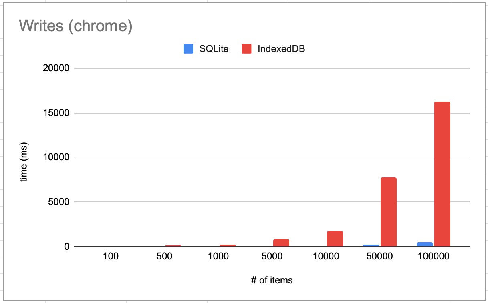
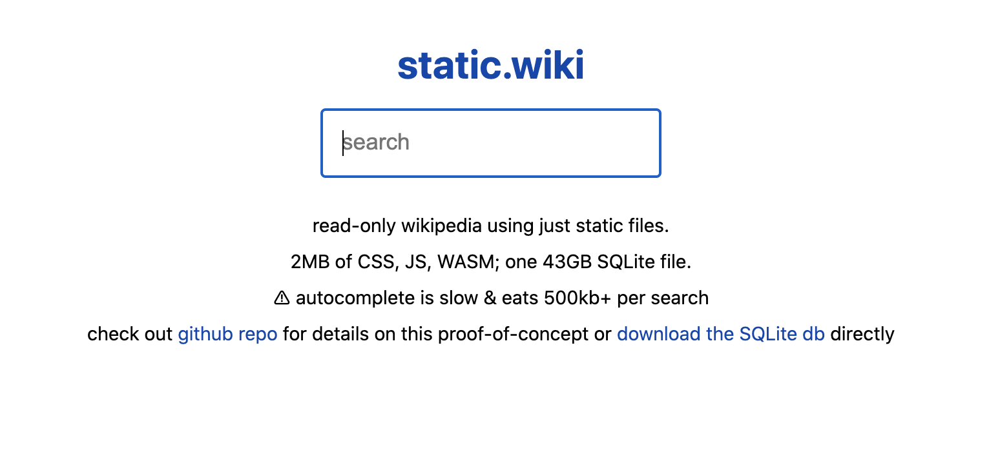

With the great power and simplicity, SQLite has been underrated compared to other SQL databases like MySQL, PostreSQL, etc. Do you know SQLite is [the most used database engine in the world](https://www.sqlite.org/mostdeployed.html)?

SQLite is outstanding on its ways, and not "just another backend database engine". Here are some fascinating integrations with SQLite:

### Running SQLite on browser

SQLite has been ported to the browser via webassemply by [sql.js](https://github.com/sql-js/sql.js)! Try SQLite in your browser on [SQLime](https://sqlime.org/).

#### And it's way faster than IndexedDB - on IndexedDB

`sql.js` keeps the data in memory. So it make sense to be faster than IndexedDB. However, if we plug IndexedDB as the storage layer to `sql.js`, it can still be 10x faster than using plain IndexedDB. That's absurd. Therefore [absurd-sql](https://github.com/jlongster/absurd-sql) was given its name.

### Static SQLite server

Thanks to the design of SQLite that having an [abstract layer (VFS) for OS interface](https://www.sqlite.org/vfs.html), porting SQLite to another OS only means implementing the thin layer with file-system-specific operations.

What if we use http-request for SQLite's virtual file system to access database data? Then we can create static website with SQLite as database, without fetching the whole database to the client at once! 

[sql.js-httpvfs](https://github.com/phiresky/sql.js-httpvfs) builds on top of `sql.js` and implements a read-only  HTTP-Range-request based virtual file system for SQLite, to make things possible such as this gigantic [static wikipedia with 43GB SQLite data](http://static.wiki/).

### Backend: dead simple db backups, and cheap

SQLite's database is just a file. Why not backup the database like a file? [litestream](https://litestream.io/) can setup a deamon or docker container to constantly backup the database for you, on popular storage service like S3.

## Supercharged static websites

To me, the most interesting thing about SQLite is the use of it on frontend. The possibilities of static website are greatly enhanced. 