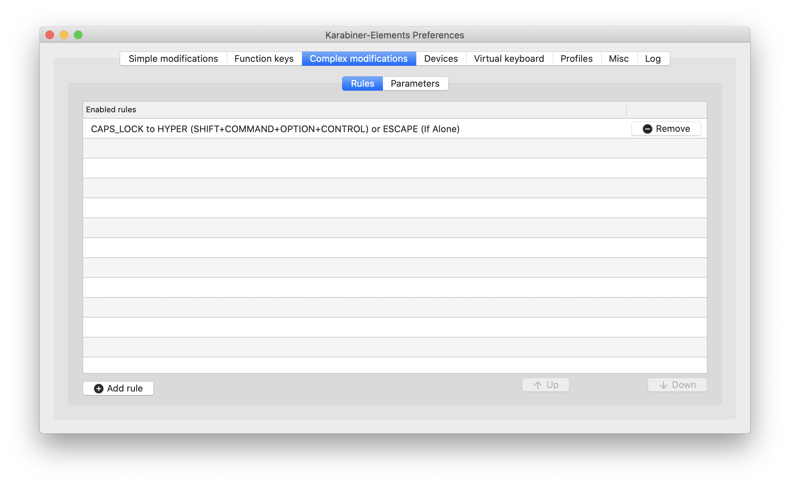
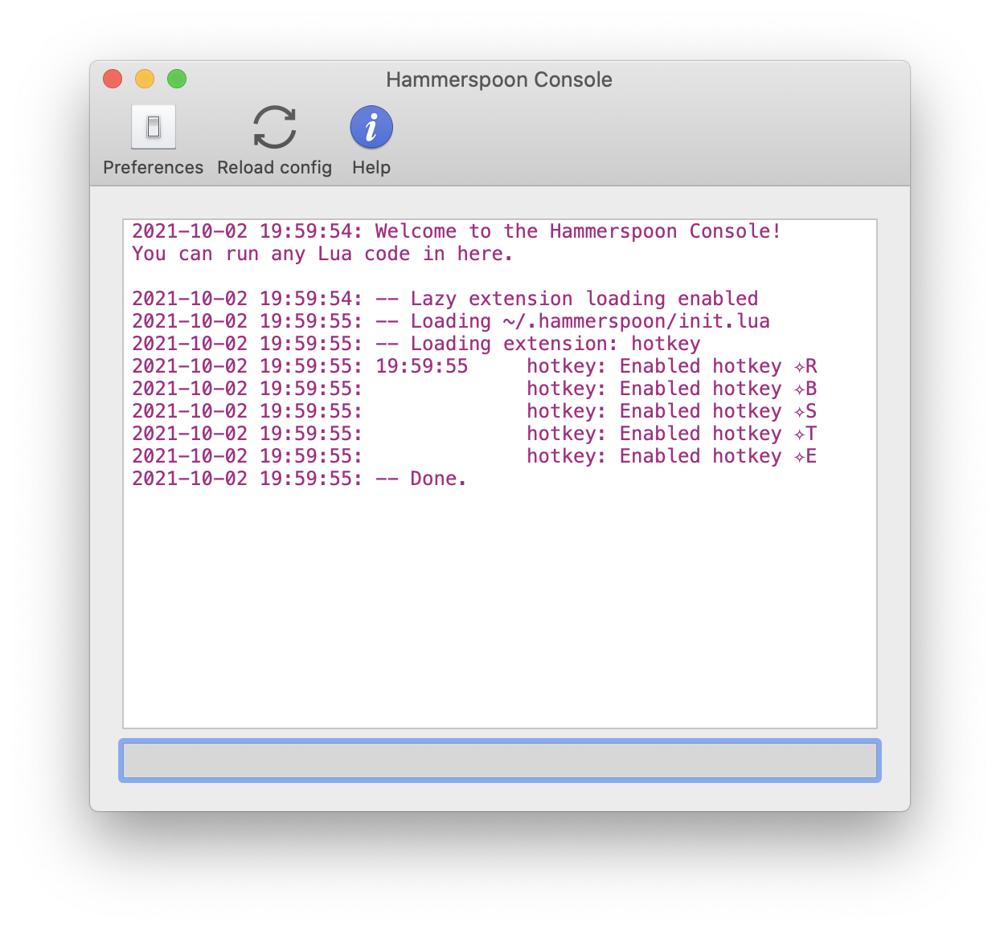

At some point, simple "Cmd + Tab" is not fast and precise enough to switch between applications. Using "Cmd + Space" to search for application is ok, but too slow for frequently used applications. 

Let's setup a few custom shortcuts like `caps+E` and `caps+S` switch between your most used applications like **VS code**, **Slack** and **Chrome** (on macOS)!

## 1. Karabiner-Elements - key combination mapping

[Karabiner](https://karabiner-elements.pqrs.org) is a popular keyboard customier for macOS. We're going to use it to change the key `caps` to `shift+cmd+option+ctrl` ("hyper key"), because we
- don't want to use too-simple shortcuts that might have been used by other applications already
- don't want to press the 4 keys at once

Follow the [instructions from the official website](https://karabiner-elements.pqrs.org/docs/getting-started/installation/) to install application, and don't miss all the security config changes required.

After Karabiner is properly set up, go to https://ke-complex-modifications.pqrs.org/#Jesse_Tutorial_Hyper_Plus_Others to import this `CAPS_LOCK to Hyper/Escape` rule set. Actually only the `CAPS_LOCK to HYPER (SHIFT+COMMAND+OPTION+CONTROL) or ESCAPE (If Alone)` rule is needed. (btw I've been long used to have `Caps` replaced with `Esc`). 

I only keep this rule after import.



## 2. Hammerspoon - define the action of shortcut

Now we need [Hammerspoon](https://www.hammerspoon.org/) to define what will be executed after pressing our hyper key shortcuts. [Follow the instruction](https://www.hammerspoon.org/) and go to github release page to download and install it.

The final step is to create your `~/.hammerspoon/init.lua`. It doesn't matter if you don't know how to write Lua yet. Here is my `init.lua`.

```lua
hyperKey = {'shift', 'control', 'option', 'command'}

-- reload config
hs.hotkey.bind(hyperKey, "r", function()
  hs.reload()
end)

appShortcutMap = {
  b = 'Google Chrome',
  e = 'Visual Studio Code',
  s = 'Slack',
  t = 'iTerm',
}

for k, v in pairs(appShortcutMap) do
  hs.hotkey.bind(hyperKey, k, function()
    hs.application.launchOrFocus(v)
    -- if hs.application.get(v):isFrontmost() then
    --   hs.application.get(v):hide()
    -- else
    --   hs.application.launchOrFocus(v)
    -- end
  end)
end
```

I've set up a few `Caps+?` shortcuts for my frequently used applications. You can change the mapping as you like.

After updating the script, you have to reload it.



If you have alrady ran the script, and are going to further modify it, the `Caps+R` shortcut should have registered to reload the config of Hammerspoon. You can use it instead of going to the console and click "Reload config".

## 3. Profit

It takes some time to suppress the urge to press `Cmd+Tab`, and use the new shortcuts. But once you get used it, it's much faster to switch between applications.