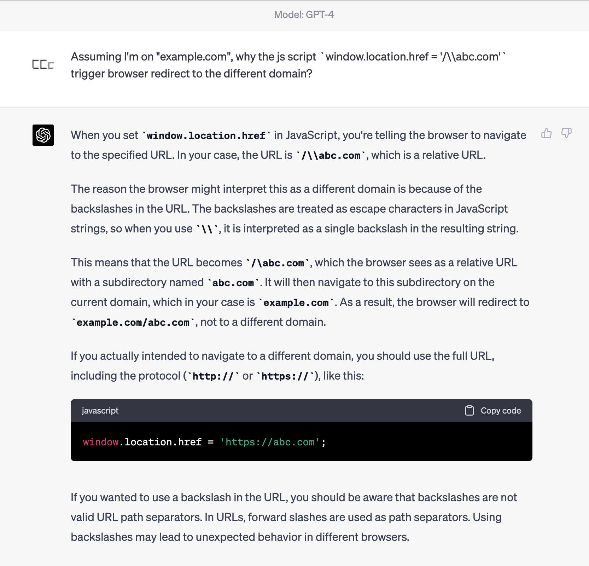
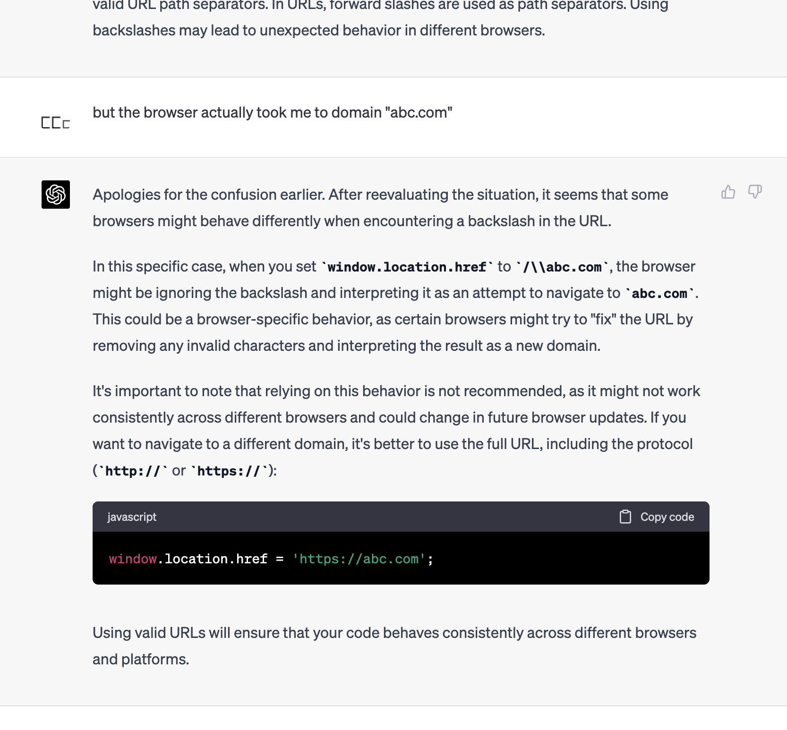
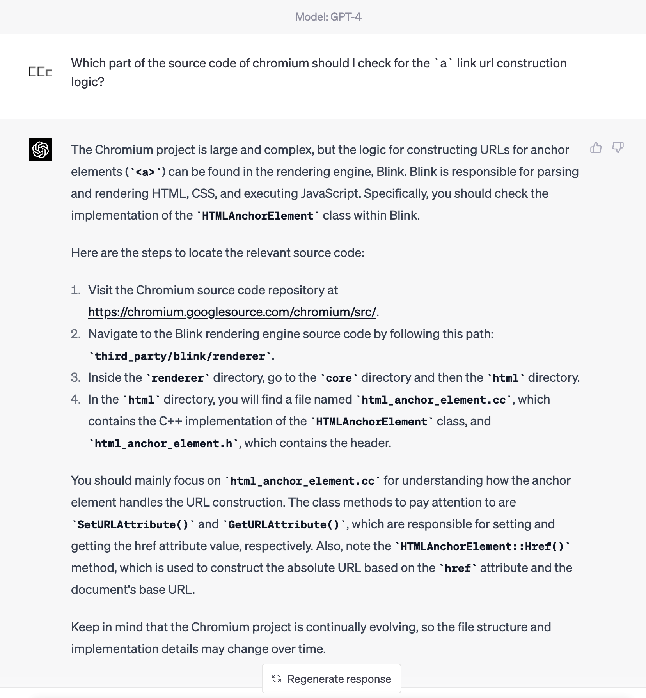
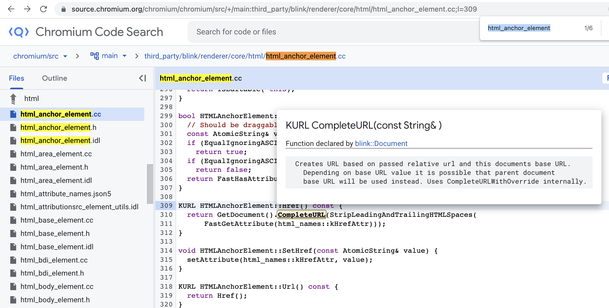
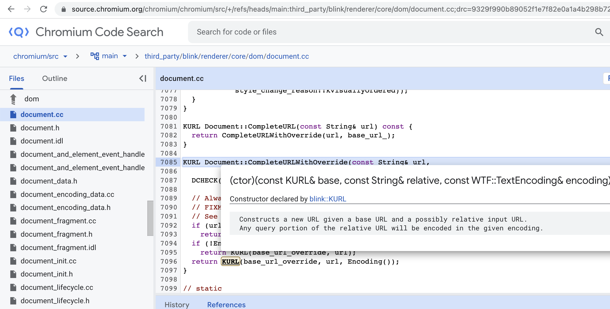
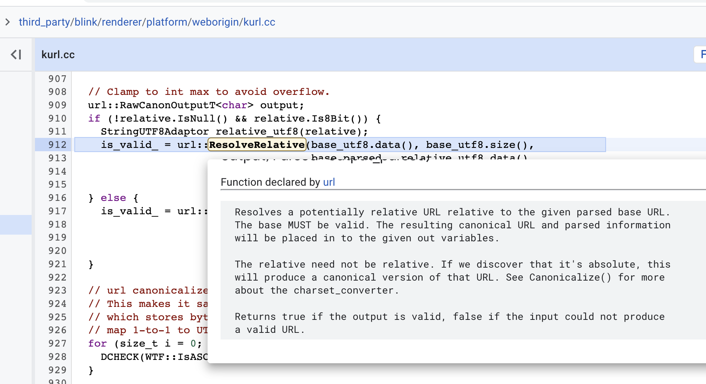
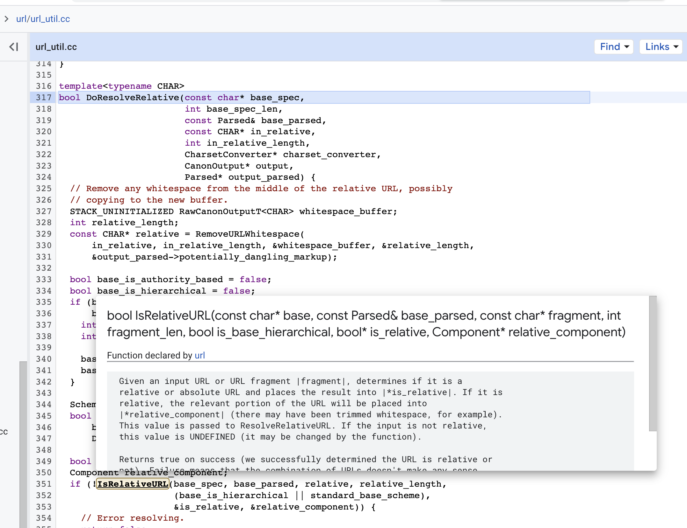
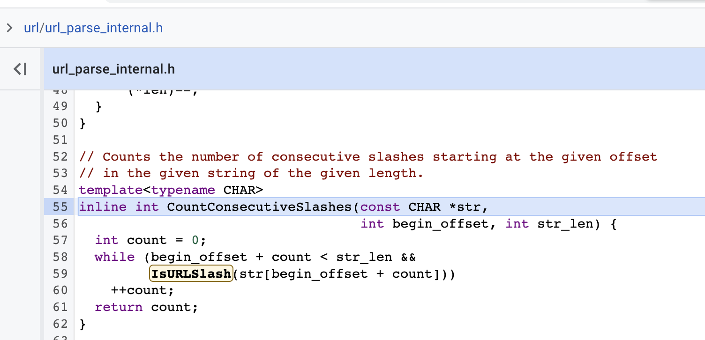
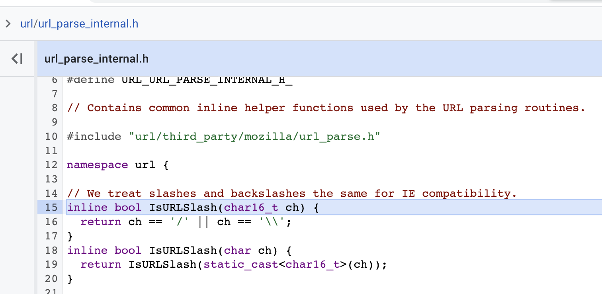

If I run this script

```ts
// originally on https://example.com
window.location.href = "/\\abc.com"
```

, where would the browser take me to? `example.com/\abc.com`? or `abc.com`?
When I first bumped into this question, I thought I know how the browser's behavior pretty well.

# Analysis

The string `"/\\abc.com"` in js has an extra backslash to escape the backslash to represent text `/\abc.com`.
As the string starts with a single forward slash `/`, it should be a relative path, right? But no.
When I run

```ts
window.location.href = "/\\abc.com"
```

, browser takes me to `abc.com`.
Which means it is indeed an absolute path. Why??

Here are the most common cases of browser redirect (potentially relative) url for redirect:

- `https://google.com`: includes protocol/scheme `https`, so it's an absolute path
- `//abc.com`: not that common, but [it's an absolute path](https://stackoverflow.com/questions/6785442/browser-support-for-urls-beginning-with-double-slash) and stated in in RFC 1808
- `/home`: the usual relative path
- `apple`: a relative path, and the redirect will replace the last part of pathname with `apple` e.g. `example.com/a/b/c` -> `example.com/a/b/apple`
- `home.html`: a relative path, similar to `apple`
- `/home.html`: a relative path, similar to `home.html`

None of the cases have anything to do with the backslash `\`.

# MDN?

Didn't mention anything special about backslash.

# Google?

Couldn't really find anything related to url redirect with backslash.

# Would ChatGPT (GPT-4) know the answer?

Let's give it a try.



Nahhh, wrong. ChatGPT thought `/\abc.com` was a relative path too.



Even given with feedback to correct the answer, ChatGPT couldn't tell why.

# More background

Actually my ultimate goal was to create a function that determines if a string would
cause domain change in browser redirect. Long story short, with the help of ChatGPT,
I have the following function:

```ts
function willDomainChangeWhenRedirect(url: string) {
  // Create a link element to easily parse the input URL
  const link = document.createElement("a")
  link.href = url

  // Get the hostname of the input URL and the current window
  const newHostname = link.hostname
  const currentHostname = window.location.hostname

  // Compare the hostnames and return true if they are different
  return newHostname !== currentHostname
}
```

At the end, I had no way to implement the logic, and had to rely on browser's implementation
to parse the url string and get the hostname. I wonder: what is the url
construction logic in the browser engine?

# Checking chromium source code

I was left with one final choice: check the source code of chromium. But the project is huge.
It would take me lots of time! What if, we ask ChatGPT for guidance?

Let's start from asking for entry point of reading the source code.



That's a good start! Then I follow the steps to try to get to the source code:

1. the chromium source code link is real,
2. the directory path is also real,
3. the directory do contains the file `html_anchor_element.cc`,
4. I couldn't find the methods `SetURLAttribute()` and `GetURLAttribute()`, but
5. I did find [`HTMLAnchorElement::Href()`](https://source.chromium.org/chromium/chromium/src/+/main:third_party/blink/renderer/core/html/html_anchor_element.cc;l=309), which is exactly what we're looking for!



I haven't written C++ since uni. But my rusty C++ knowledge served me good.
After some digging, I traced to the [`KURL()`](https://source.chromium.org/chromium/chromium/src/+/refs/heads/main:third_party/blink/renderer/core/dom/document.cc;l=7096;drc=9329f990b89052f1e7f82e0a1a4b298b72359263;bpv=1;bpt=1) constructor in `third_party/blink/renderer/core/dom/document.cc`.



Here is the `KURL` init function

```cpp
void KURL::Init(const KURL& base,
                const String& relative,
                const WTF::TextEncoding* query_encoding) {
  // As a performance optimization, we do not use the charset converter
  // if encoding is UTF-8 or other Unicode encodings. Note that this is
  // per HTML5 2.5.3 (resolving URL). The URL canonicalizer will be more
  // efficient with no charset converter object because it can do UTF-8
  // internally with no extra copies.

  StringUTF8Adaptor base_utf8(base.GetString());

  // We feel free to make the charset converter object every time since it's
  // just a wrapper around a reference.
  KURLCharsetConverter charset_converter_object(query_encoding);
  KURLCharsetConverter* charset_converter =
      (!query_encoding || IsUnicodeEncoding(query_encoding))
          ? nullptr
          : &charset_converter_object;

  // Clamp to int max to avoid overflow.
  url::RawCanonOutputT<char> output;
  if (!relative.IsNull() && relative.Is8Bit()) {
    StringUTF8Adaptor relative_utf8(relative);
    is_valid_ = url::ResolveRelative(base_utf8.data(), base_utf8.size(),
                                     base.parsed_, relative_utf8.data(),
                                     ClampTo<int>(relative_utf8.size()),
                                     charset_converter, &output, &parsed_);
  } else {
    is_valid_ = url::ResolveRelative(base_utf8.data(), base_utf8.size(),
                                     base.parsed_, relative.Characters16(),
                                     ClampTo<int>(relative.length()),
                                     charset_converter, &output, &parsed_);
  }

  // url canonicalizes to 7-bit ASCII, using punycode and percent-escapes
  // This makes it safe to call FromUTF8() below and still keep using parsed_
  // which stores byte offsets: Since it's all ASCII, UTF-8 byte offsets
  // map 1-to-1 to UTF-16 codepoint offsets.
  for (size_t i = 0; i < output.length(); ++i) {
    DCHECK(WTF::IsASCII(output.data()[i]));
  }

  // AtomicString::fromUTF8 will re-hash the raw output and check the
  // AtomicStringTable (addWithTranslator) for the string. This can be very
  // expensive for large URLs. However, since many URLs are generated from
  // existing AtomicStrings (which already have their hashes computed), this
  // fast path is used if the input string is already canonicalized.
  //
  // Because this optimization does not apply to non-AtomicStrings, explicitly
  // check that the input is Atomic before moving forward with it. If we mark
  // non-Atomic input as Atomic here, we will render the (const) input string
  // thread unsafe.
  if (!relative.IsNull() && relative.Impl()->IsAtomic() &&
      StringView(output.data(), static_cast<unsigned>(output.length())) ==
          relative) {
    string_ = relative;
  } else {
    string_ = AtomicString::FromUTF8(output.data(), output.length());
  }

  InitProtocolMetadata();
  InitInnerURL();
  DCHECK(!::blink::ProtocolIsJavaScript(string_) || ProtocolIsJavaScript());

  // Check for deviation characters in the string. See
  // https://unicode.org/reports/tr46/#Table_Deviation_Characters
  has_idna2008_deviation_character_ =
      base.has_idna2008_deviation_character_ ||
      relative.Contains(u"\u00DF") ||  // Sharp-s
      relative.Contains(u"\u03C2") ||  // Greek final sigma
      relative.Contains(u"\u200D") ||  // Zero width joiner
      relative.Contains(u"\u200C");    // Zero width non-joiner
}
```

The `url::ResolveRelative()` function seems to be one holding the logic.



And then I traced to [`DoResolveRelative()`](https://source.chromium.org/chromium/chromium/src/+/refs/heads/main:url/url_util.cc;drc=9329f990b89052f1e7f82e0a1a4b298b72359263;l=317) in `url/url_util.cc`. We're getting close!

```cpp
template<typename CHAR>
bool DoResolveRelative(const char* base_spec,
                       int base_spec_len,
                       const Parsed& base_parsed,
                       const CHAR* in_relative,
                       int in_relative_length,
                       CharsetConverter* charset_converter,
                       CanonOutput* output,
                       Parsed* output_parsed) {
  // Remove any whitespace from the middle of the relative URL, possibly
  // copying to the new buffer.
  STACK_UNINITIALIZED RawCanonOutputT<CHAR> whitespace_buffer;
  int relative_length;
  const CHAR* relative = RemoveURLWhitespace(
      in_relative, in_relative_length, &whitespace_buffer, &relative_length,
      &output_parsed->potentially_dangling_markup);

  bool base_is_authority_based = false;
  bool base_is_hierarchical = false;
  if (base_spec &&
      base_parsed.scheme.is_nonempty()) {
    int after_scheme = base_parsed.scheme.end() + 1;  // Skip past the colon.
    int num_slashes = CountConsecutiveSlashes(base_spec, after_scheme,
                                              base_spec_len);
    base_is_authority_based = num_slashes > 1;
    base_is_hierarchical = num_slashes > 0;
  }

  SchemeType unused_scheme_type = SCHEME_WITH_HOST_PORT_AND_USER_INFORMATION;
  bool standard_base_scheme =
      base_parsed.scheme.is_nonempty() &&
      DoIsStandard(base_spec, base_parsed.scheme, &unused_scheme_type);

  bool is_relative;
  Component relative_component;
  if (!IsRelativeURL(base_spec, base_parsed, relative, relative_length,
                     (base_is_hierarchical || standard_base_scheme),
                     &is_relative, &relative_component)) {
    // Error resolving.
    return false;
  }

  // Don't reserve buffer space here. Instead, reserve in DoCanonicalize and
  // ReserveRelativeURL, to enable more accurate buffer sizes.

  // Pretend for a moment that |base_spec| is a standard URL. Normally
  // non-standard URLs are treated as PathURLs, but if the base has an
  // authority we would like to preserve it.
  if (is_relative && base_is_authority_based && !standard_base_scheme) {
    Parsed base_parsed_authority;
    ParseStandardURL(base_spec, base_spec_len, &base_parsed_authority);
    if (base_parsed_authority.host.is_nonempty()) {
      STACK_UNINITIALIZED RawCanonOutputT<char> temporary_output;
      bool did_resolve_succeed =
          ResolveRelativeURL(base_spec, base_parsed_authority, false, relative,
                             relative_component, charset_converter,
                             &temporary_output, output_parsed);
      // The output_parsed is incorrect at this point (because it was built
      // based on base_parsed_authority instead of base_parsed) and needs to be
      // re-created.
      DoCanonicalize(temporary_output.data(), temporary_output.length(), true,
                     REMOVE_WHITESPACE, charset_converter, output,
                     output_parsed);
      return did_resolve_succeed;
    }
  } else if (is_relative) {
    // Relative, resolve and canonicalize.
    bool file_base_scheme = base_parsed.scheme.is_nonempty() &&
        DoCompareSchemeComponent(base_spec, base_parsed.scheme, kFileScheme);
    return ResolveRelativeURL(base_spec, base_parsed, file_base_scheme, relative,
                              relative_component, charset_converter, output,
                              output_parsed);
  }

  // Not relative, canonicalize the input.
  return DoCanonicalize(relative, relative_length, true,
                        DO_NOT_REMOVE_WHITESPACE, charset_converter, output,
                        output_parsed);
}
```

And then we get closer:



At first glance, the function `IsRelativeURL()` only process the params and return a boolean.
But after a closer look, the function is also putting the url result in the
pointer param. Oh right, it's a norm to do that in C++.

And finally we get to [`DoIsRelativeURL()`](https://source.chromium.org/chromium/chromium/src/+/refs/heads/main:url/url_canon_relative.cc;l=103;drc=9329f990b89052f1e7f82e0a1a4b298b72359263;bpv=0;bpt=1) in `url/url_canon_relative.cc`,
that follow some logic to determine if the string is a relative url or absolute url.

```cpp
// See IsRelativeURL in the header file for usage.
template<typename CHAR>
bool DoIsRelativeURL(const char* base,
                     const Parsed& base_parsed,
                     const CHAR* url,
                     int url_len,
                     bool is_base_hierarchical,
                     bool* is_relative,
                     Component* relative_component) {
  *is_relative = false;  // So we can default later to not relative.

  // Trim whitespace and construct a new range for the substring.
  int begin = 0;
  TrimURL(url, &begin, &url_len);
  if (begin >= url_len) {
    // Empty URLs are relative, but do nothing.
    if (!is_base_hierarchical) {
      // Don't allow relative URLs if the base scheme doesn't support it.
      return false;
    }
    *relative_component = Component(begin, 0);
    *is_relative = true;
    return true;
  }

#ifdef WIN32
  // We special case paths like "C:\foo" so they can link directly to the
  // file on Windows (IE compatibility). The security domain stuff should
  // prevent a link like this from actually being followed if its on a
  // web page.
  //
  // We treat "C:/foo" as an absolute URL. We can go ahead and treat "/c:/"
  // as relative, as this will just replace the path when the base scheme
  // is a file and the answer will still be correct.
  //
  // We require strict backslashes when detecting UNC since two forward
  // slashes should be treated a a relative URL with a hostname.
  if (DoesBeginWindowsDriveSpec(url, begin, url_len) ||
      DoesBeginUNCPath(url, begin, url_len, true))
    return true;
#endif  // WIN32

  // See if we've got a scheme, if not, we know this is a relative URL.
  // BUT, just because we have a scheme, doesn't make it absolute.
  // "http:foo.html" is a relative URL with path "foo.html". If the scheme is
  // empty, we treat it as relative (":foo"), like IE does.
  Component scheme;
  const bool scheme_is_empty =
      !ExtractScheme(url, url_len, &scheme) || scheme.len == 0;
  if (scheme_is_empty) {
    if (url[begin] == '#') {
      // |url| is a bare fragment (e.g. "#foo"). This can be resolved against
      // any base. Fall-through.
    } else if (!is_base_hierarchical) {
      // Don't allow relative URLs if the base scheme doesn't support it.
      return false;
    }

    *relative_component = MakeRange(begin, url_len);
    *is_relative = true;
    return true;
  }

  // If the scheme isn't valid, then it's relative.
  if (!IsValidScheme(url, scheme)) {
    if (url[begin] == '#' &&
        base::FeatureList::IsEnabled(
            kResolveBareFragmentWithColonOnNonHierarchical)) {
      // |url| is a bare fragment (e.g. "#foo:bar"). This can be resolved
      // against any base. Fall-through.
    } else if (!is_base_hierarchical) {
      // Don't allow relative URLs if the base scheme doesn't support it.
      return false;
    }
    *relative_component = MakeRange(begin, url_len);
    *is_relative = true;
    return true;
  }

  // If the scheme is not the same, then we can't count it as relative.
  if (!AreSchemesEqual(base, base_parsed.scheme, url, scheme))
    return true;

  // When the scheme that they both share is not hierarchical, treat the
  // incoming scheme as absolute (this way with the base of "data:foo",
  // "data:bar" will be reported as absolute.
  if (!is_base_hierarchical)
    return true;

  int colon_offset = scheme.end();

  // If it's a filesystem URL, the only valid way to make it relative is not to
  // supply a scheme. There's no equivalent to e.g. http:index.html.
  if (CompareSchemeComponent(url, scheme, kFileSystemScheme))
    return true;

  // ExtractScheme guarantees that the colon immediately follows what it
  // considers to be the scheme. CountConsecutiveSlashes will handle the
  // case where the begin offset is the end of the input.
  int num_slashes = CountConsecutiveSlashes(url, colon_offset + 1, url_len);

  if (num_slashes == 0 || num_slashes == 1) {
    // No slashes means it's a relative path like "http:foo.html". One slash
    // is an absolute path. "http:/home/foo.html"
    *is_relative = true;
    *relative_component = MakeRange(colon_offset + 1, url_len);
    return true;
  }

  // Two or more slashes after the scheme we treat as absolute.
  return true;
}
```

Near the end of the function, the code is counting the number of consecutive slashes
(at the beginning of the substring, right after scheme colon offset, if any)
to determine if the url is a relative one. But it doesn't mention whether
it's slash or backslash. Hmmmmm.



A function [`IsURLSlash()`](https://source.chromium.org/chromium/chromium/src/+/refs/heads/main:url/url_parse_internal.h;l=15;drc=991110a34dafb7233475cdfa91c3416d1e91b724;bpv=1;bpt=1)...?



Omg, it treats backslash the same as normal slash, for IE compatibility!

Which means, the string `\\abc.com` could also cause domain change in redirect.

# What I've learnt

First of all, **the browser redirect url construction is complicated, and not standardized**.
We must rely on browser API to produce the exact result.

Second, ChatGPT's performance is extraordinary!
Although it could not give us the correct answer like a miracle machine,
**the guidance from ChatGPT in reading source code significantly reduced the learning barrier**. It's like
getting help from a chromium developer, pointing directions for you to understand the codebase.
If you feed it a function source code, it can do a very good summary about what the code is doing.
Can't imagine how far would it get after a year or two.
