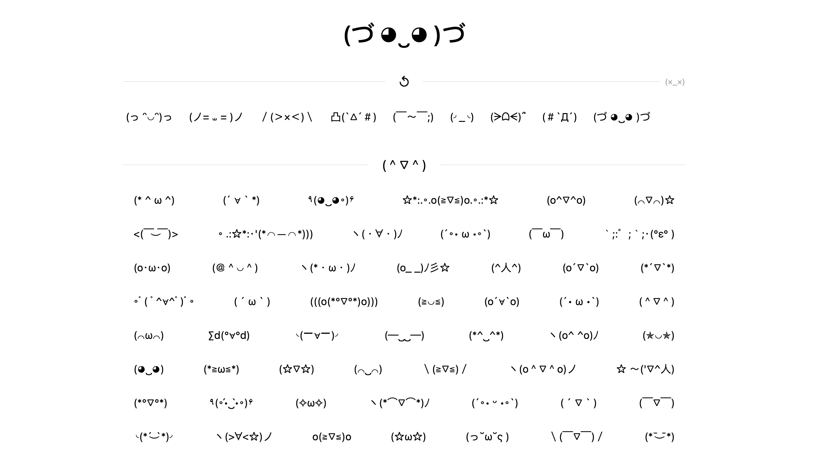
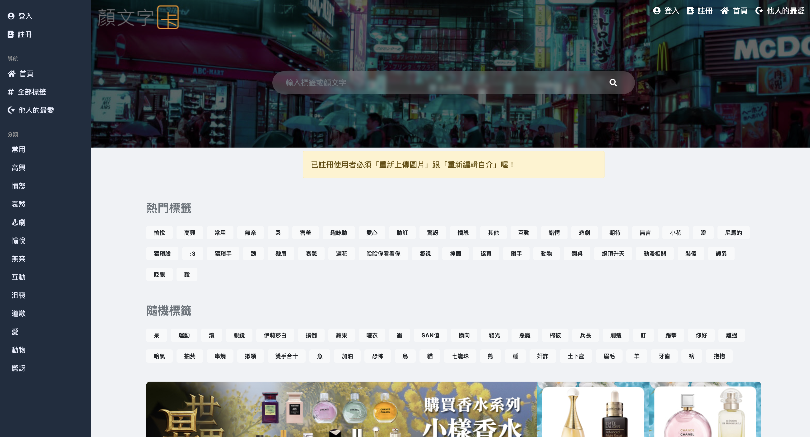
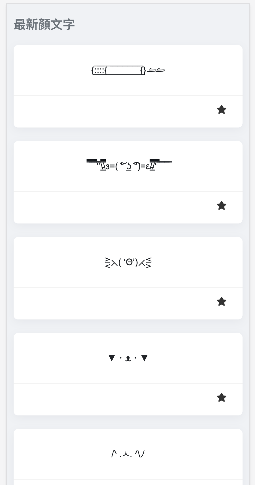
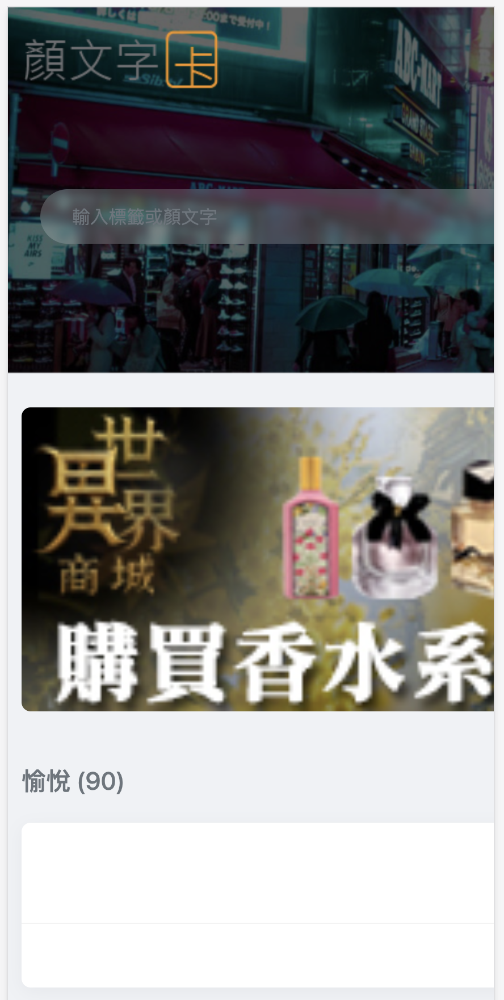
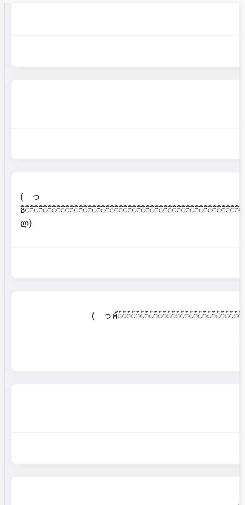

The creative variation of 顏文字 (kaomoji) has always been fasinating to me. Cute and easy to use as text.
But we I want to search for one online, the first few search results of popular kaomoji websites are always so bad.
They all have a simple purpose: to let user search and copy kaomoji. But the UX can't be worse.

With the rise of AI technology, it can't be easier to create new projects and web apps with agents.
I finally made up my mine to make my self one, a kaomoji copy web app (＃`Д´)

The final product is here: https://kaomoji.online/

# The popular website UI sucks

A kaomoji copy website is quite niche. Most of the websites look old. Take the first google search result as an example:

From the first look of homepage, it's nothing like a website for searching & copying kaomoji. All the UI are chinese texts.
Bloated with all kinds of tags and categories.

## The easy way, the bad way

When one designs a website for user to search categoried kaomoji, the first thing that comes to mind would possibly be simply showing all the available categories for user to choose from. The straight forward thinking:

1. I have a bunch of kaomoji data, most of them are categorized already
2. If the UI shows the categories, then the user can use it to search and find what they want
3. Make a website with 13 categories and 40+ tags for user to choose from

It might work, but it's totally not what the user may be thinking when using the website at all.

### Overwhelming category choices

When I go to an online shopping mall to buy something, I already have a rough idea of the type of thing it is.
Milk: probably supermarket. Powerbank: electronics. Air fryer: kitchen appliance maybe.

People already have a rought idea about the type of thing it is.

But for kaomoji, there can be many categories. And user **probably don't know about them**.
User would need to check all the provided categories. It's **tiring**. The mental load is huge.
Asking user to pick one from many unfamiliar choices deters user.

### Ambiguous category

Can you guess the category of the kaomoji "／(＞ × ＜)＼" ?

How about "(っ ᵔ◡ᵔ)っ" ?

It's just disgusting to let user to use a chinese text category/tag to reduce the scope.

## Where are the kaomoji?

I can't believe the first view of the homepage are just countless categories and tags.
It fails to deliver the message of **what is this website about?**

## Too much spacing

If the category fails its job, the user would just want to quickly scan through the pages to look for the most suitable kaomoji.
But there are just too much spacing, and too few content.

## The dreadful text overflow

Some kaomoji are very long. If the kaomoji happens to be in list, the dreadful horizontal scrollbar appears.

  
  

# Making my own kaomoji website

My goal was simple: I need a minimalist website for searching and copying kaomoji. No login, no user submission, no searching.

## superpowers

If it was 3 years ago, I might not have enough motivation to make one.

If it was 1 year ago, I might make one but it would take more effort working with agent.

If I make it today, I know more about vibe coding now. The first thing came to my mind was making use of the popular development methodology: https://github.com/obra/superpowers

It's a set of pre-defined skills and workflow prompts, for working on dev project more structured, effective, and robust.
Instead of random vibe coding chat with agent, the superpowers setup provides a more mature workflow and agent context.
Working with it is more pleasant, and less headache with overlooked technical details and mistakes.

However, since superpowers is made for claude code as a claude code plugin, and I'm using Cursor, it needs a bit of chore to migrate it to cursor setup. For convenience, I put the cursor setup to a new repo for reuse https://github.com/chauchakching/superpowers-cursor.

## Getting started

Working with superpowers was pleasant: it starts with providing your initiative, then it asks you a bunch of questions to clarify the goal, scope, and technical decisions.

After answering all the questions, it generates 1 or 2 plans docs. Then ask for proceeding to implementation phase.

Luckily, Cursor subagent feature was released not long ago. The workflow can make use of subagents to orchestrate the whole implementation in one main chat. Usually you can put aside it and work on something else, to wait for it to complete. It automatically implement, review, and complete the tasks one by one.

## Planning

The agent found a few sources of kaomoji. I picked one that already has categorization.

The rest are the usual stuffs: React, Typescript, Vite.

## Feature & UX Iteration

The first prototype was quite good. Then I progressively work on the UI enhancements and features.

At the end, it took me about 3-4 hrs to compelte the whole thing.

## Your judgement is the limit of AI

It's easy to make a web app with AI. But it's not that easy to make a good one. If you accept everything from AI, it's not going to end well.

Some of the insights from me:

- I want to make the whole website with just kaomoji. No text.
- Text category sucks. Just put 6 main categories. Small enough for user to comprehend.
- The fine tuning of the layout and spacing are up to me at the end. AI is particularly bad at these stuffs. The balance, visual hierarchy, and aesthetic polish require human judgment.

## Final chore: domain registration

I bought the cheapest domain of $1.2 on namespace. And deployed it to cloudflare pages.

Voila, my own kaomoji website. Finally.
